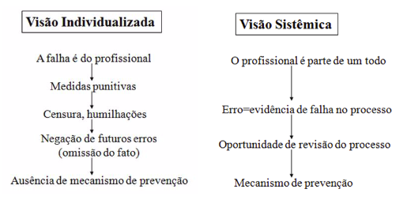
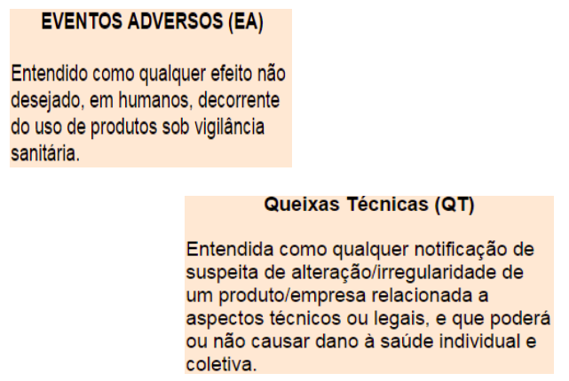
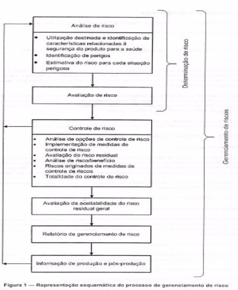
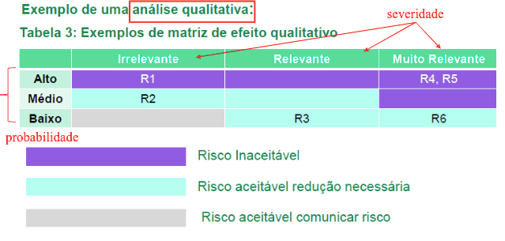
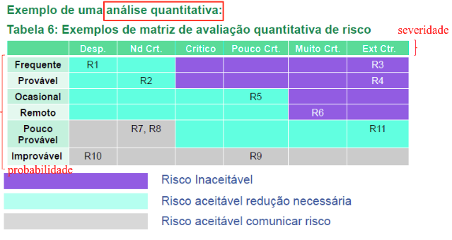

# Eclin1
Notas de aulas sobre os slides 11 ao 18 de eclin1.

Caso esteja procurando a lista de normas clique [aqui](normas).

## Aula 11
Segurança no Ambiente Hospitalar - Riscos nos EAS

### Risco
* `Risco == Ousar`
```
Entende-se "risco" como possibilidade de "algo não dar certo"
```
* **Atualmente**: **Quantificação** e **qualificação** da **incerteza**, tanto no que diz respeito às "perdas" como aos "ganhos", como relação ao rumo dos acontecimentos planejados.

### Risco no EAS

* **Fator de Risco**: Qualquer situação que aumente a probabilidade de ocorrência de uma doença ou agravo à saúde.

* Risco: É a probabilidade de ocorrencia de uma doença ...xablaus...relacionada à saúde em uma população durante um determinado período.

    * **Probabilidade** de um evento perigoso: Condições de uma variável com potencial necessário para causar danos (lesões, danos a equipamentos, instalações, meio ambiente, perda de material).

    * **Severidade** da consequência do evento perigoso.

###  Gestão de Riscos

* Processo por meio do qual as organizaçõs lidam com o risco associado à sua atividade.
* Medidas de prevenção que devem ser adotadas, para **eliminar**, **prevenir** ou **minimizar** um ou vários pontos críticos ou de risco.

* **PROBLEMA**:
    * **Super** estimar o risco.
    * **Sub** estimar o risco.

###  No EAS

```
Investigação de ocorrências como Ferramenta da Qualidade dos serviços de Saúde
```
* Impulsiona **mudança cultural** institucional e proficional.
* Incentiva atitudes **não punitivas**.
* Possibilita **correção** dos pontos **vulneráveis** do sistema.
* Permite **prevenção** de falhas.
* Garante **maior segurança** a pacientes e prestadores de serviço.



### 5 Pilares

1. **Farmaco** vigilância.
1. **Tecno** vigilância.
1. **Hemo** vigilância.
1. Gestão de Resíduos. **(GRH)**
1. Controle de **Infecção** Hospitalar.

### Algumas definições

* EA - **Eventos Adversos**: Efeito não desejado, em humanos, decorrente do uso de produtos sob vigilância sanitária.
* QT - **Queixas Técnicas**: Notificação de suspeita de alteração/irregularidade de um produto/empresa relacionada a aspectos técnicos ou legais, e que poderá ou não causar dano à saúde individual e coletiva.

### Segundo site da ANVISA

* Tecnovigilância <s>é o sistema de vigilância de</s> eventos adversos e queixas técnicas <s>para a saúde na fase de</s>  pós-comercialização, <s>com vistas a recomendar a adoção de medidas que garantam a proteção e a promoção da sáude da população. A tecnovigilância visa a segurança saniátia de protudos para saúde pós-comercialização </s>(Equipamentos, MAteriais, Artigos Médico-Hospitalares, Implantes e Produtos para Diagnóstico de Uso "in-vitro").

## Aula 12
Continuando sobre riscos

### Normas

- [X] <s>RDC2 de 2010</s> (Geren. de tec. em EAS) - **RDC20 de 2012**

- [X] **RDC63 de 2011** (Req. de Boas Práticas de Func. para os Serv. de Saúde)

- [X] **RDC23 de 2012**: Dispõe sobre a obrigatoriedade de execução e notificação de ações de campo por detentores de registro de protudos para saúde no Brasil. Li mas não entendi bulhufas kkk


Acabou a aula.

## Aula 13
Segurança no Ambiente Hospitalar - NOTIVISA, Rede Sentinela, Normas

### Riscos nos EAS

A partir do de 2001-2 a Anvisa começou a investir em: *Ações de Vigilância Sanitária de Produtos de Saúde Pós-Uso/Comercialização (Vigipos)*. Como forma de ... retroalimentação dos processos de revalidação de registros...

Estratégia: Constituição e capacitação de uma rede de hospitais sentinela com nome *REDE BRASILEIRA DE HOSPITAIS SENTINELA* (bem criativo).

#### O que é a rede Sentinela

Composta por hospitais de alta complexidade e/ou de ensino, para atuarem como observatórios ativo do desempenho e segurança de protudos de saúde regularmente usados: medicamentos, kits para exametes laboratoriais, órteses...

* **VIGIPÓS**: vigilância de pós-uso/pós-comercialização.
Vigilancia de EA e QT dos prod. sob a vigilancia saniátia.

Monitoramento do uso desses produto, bem como a utilização de métodos epidemiológicos para análise.

Adotou-se  uma forma transversal de trabalhar, que permite integração entre as diversas áreas da Anvisa, com o SNVS...

A **VIGIPÓS** deve ser capaz de detectar precocemente problemas relacionados a produtos e outras tecnologias e desencadear as medidas pertinentes para que o risco seja interrompido ou  minimizado.Em outras palavras, quanto todas as atividades pŕevias não são suficientes para eliminar completamente os riscos, o sistema de vigilância deve ser sensível para que os danos porventura existentes sejam os menores possíveis.


A **VIGIPÓS** deve produzir informações que permitem retroalimentar os sistemas de controle e orientar os cidações e profissionais de saúde para a prevenção de riscos.

### Rede Sentinela
A rede sentinela funciona como observatório

no âmbito dos servições para o gerenciamento de riscos Á saúde, em atuação conjunta e efetiva com o
SNVS (**Sistema Nacional de Vigilância Sanitária**). Foi instituída ma *Gerência de Risco* em cada serviçp que compõe a rede, que representa a referência interna da Vigipós nas instituições.

**Os servições** que compões a Rede notificam e monitoram eventos adversos e queixas tecnicas de produtos sob vigilância sanitária (medicamentos, vacinas e imunoglobulinas,  pesquisas clinicas, cosmeticos, produtos de higiene pessoal ou perfume, artigos e quipamentos medico-hospitalares, git reagente para diagnostico in viro, uso de sangue ou componentes, saneamento e agrotoxicos) em uso no Brasil, fazendo a vigipos dos produtos utilizados nos estabelecimentos de saúde.

As suspeitas de eventos adversos e queijas tecnicas são monitorados e investigados juntamente com a Vigilancia Sanitaria. A conclusão dessas insvertigaçõs pode resultar em diversas decisões como a retirada do protudo do mercado, a restrição de uso e de comercialização entre outras intervenções.

### Como participar da rede sentinela
Perfis:
* Participantes: Existencia e funcionamento da gerencia de risco, com alimentação regular dos bancos de dados da vigipos. E o perfil de entrada ma rede sentinela, obrigatorio para permanencia na mesma.

* Colaborador: Capacidade para desenvolvimento de estudos de interesse no sistema de saude brasileiro

* Centro de cooperação: Cooperação horizontal para atvdades de formação pessoal e educação continuada e outras institu de saude ou capacid p/  desenvol. de material institucional.

* Centro de referência: Coordenação e ou supervisão de sub-redes com foco em temas ou tecnologias específicas.

### Infos sobre Sentinela

Antes: **Total do brasil**: 193 servições da rede sentinela
Agora: **Total do brasil**: 232 servições da rede sentinela

A UFU ta nela

### NOTIVISA
Sistema de Notificação em Vigilância Sanitária

* **Objetivo** --> O notivisa é um sistema informatizado desenvolvido pela Anvisa para receber notificação de incidentes, eventos adversos (ES) e queixas técnicas (QT) relacionadas ao uso de produtos e de servições sob vigilÂncia sanitária.



### Exemplos de notificações de EA

* Incidente / evento adverso durante procedimento cirurgico
* Queda do pacientes
* Ulcera por pressao (mto tempo deitado)
* Inefetificada terapeutica de algum medicamento
* Erros de medicação apenas qnd houver dano a saude (pos exemplo edema provocado por ma administa de injetavel)
* Evento adverso decorrente do uso de artigo medico hospitalar ou equipamento medido hospitalar.
* Reação transfusional decorrente de transfução sanguinia.
* Evento adverso decorrente do uso de um produto cosmetico
* Evento adverso decorrente do uso de um produto saneante.

### Exemplos de QT
* Produto (todos listados exceto sangue e compoentes) com suspeita de desvio de Qualidade
* Produto com suspeita de estar sem registro
* Suspeita de produto falsificado
* Suspeita de empresa sem autorização de funcionamento (**AFE**).

### Quem faz as notificações:
* Profissionais de servicoes de saude (núcleos de segurança do paciente, hospitais, clinicas, hemocentos, laboratorios, CIAT's, dentre outros)
* Profissionais/técnicos da Anvisam das Vigilâncias Sanitaria Estatuais e municiapais, das secretarias estaduais e minicipais de saude.
* Profissionais de Laboratorios de Saude publica, universidades/centros de pesquisa.
* Profissionais que atuam em drogarias e farmacias.
* Profissionais das empresas detentoras de registro de produtos sob vigilancia sanitaria (fabricantes, importadoress e distribuidores)
* Profissionais de saude liberais
* Cidadãos - Pacientes, familiares, acompanhantes, cuidadores e outros

CIAT - Centro Integrado de Atenção ao trabalhador.

### NOTIVISA

Objetivo: O Notivisa é um sistema informatizado desenvolvido pela Anvisa para receber notificações de incidents, eventos adversos (EA) e queixas técnicas (QT) relacionadas ao uso de produtos e de servições sob vigilância sanitária.

#### Incidente / Evento Adverso
* EA nas atividades admnistrativas.
* Infecões.
* Falhas no cuidado do pacitente.
* EA nas dieatas
* Queda do paciente
...
#### Queixas tecnicas - qnd não houve dano ao paciente
* Desvio de Qualidade
* Produto falsificado.
* Produto sem Registo.
* Empresa sem AFE.

## Aula 14
Segurança no Ambiente Hospitalar Normas

- [ ] **Portaria 1660 de 2009**: Notivisa, VIGIPOS,  SNVS, como parte do SUS.
- [ ] **Portaria 529 de 2013**: PNSP - programa nacional de segurança do paciente.
- [ ] **RDC 36 de 2013**: Segurança do paciente
- [ ] **RDC53 de 2013**: Altera a rdc36
- [ ] **RDC16 de 2013**: Boas praticas para fabricação de prods.

### Riscos nos EAS

NSP (núcleo de segurança d paciente) realiza a notificação dos eventos adversos do Sistema Nacional de Vigilância Sanitária em ate 15 dias da ocorrencia
EA -> 15 dias
Morte -> 72 horas.

Exemplos de EA: Queda, infecções, e agravamento por falhas.

Registro por ferramentas eletrônicas.

Prods p/ diagnostico de uso in-vitro: reagentes, calibradores xablaus para determinar algo xablaus de alguma coisa xablaus do corpo human. medidor de algo.

```
Reagentes, padrões, calibradores, controles, mareiais,
artigos e instrumentos, junto com as instruções para seu
uso, que contribuem para realizar uma determinação qualitativa, quantitativa ou semi-quantitativa de uma
amostra proveniente do corpo humano e que não estejam destinados a cumprir alguma função anatômica,
física ou terapêutica, que não sejam ingeridos, injetados
ou inoculados em seres humanos e que são utilizados
unicamente para prover informação sobre amostras
obtidas do organismo humano.
```

## Aula 15
Infecção Hospitalar

* Programa de Controle de infecção Hospitalar começou em 1983.

Portaria MS 196/83
* **CCIH**: Comissões de Controle de Infecção Hospitalar.
    * Vigilânia epidemiológica com coleta de dados, a notificação feita pelo médico ou enfermeira, elaboração de normas técnicas, isolamento de pacientes, controle do uso de antimicrobioanos, normas de seleção de germicidas e preenchimento de relatórios.

Portaria 930/92 - revoga a 196/83

* **SCIH**: Servições de Controle de Infecção Hospitalar.
    * Execução das ações programadas de contr. d. infec. hosp.

Lei 9431/97

* **PCIH**: Programa de Controle de Infecções Hospitalares.
    * *conjunto de ações desenvolvidas deliberada e sistematicamente com vistas à redução máxima possível da incidência e da gravidade das infecções hospitalares.*
    * infec. hosp: infec institucional ou nosocomial, qlqr infec. adquirida apos internação de um paciente em um hospital e que se manifeste durante ou apos. que pode ser relacionada a hospitalização.
    * deve ter: CCIH - Comissão de Controle de Infecções Hospitalares.

Portaria 2616/98 -> revogou a 930/92

### Importante

* Lavagem das mãos
* Qualidade do ar -> *pode exercer uma influencia direta e de grande significancia na velocidade de recuperação dos pacientes e na frequência de ocorrência de infecções hospitalares*

* portaria 3523/98 -> Medidas básicas referentes Á manutenção dos sistemas de climatização para garantir a "Qualidade do Ar de Interiores" e prevenção de riscos á saúde dos ocupantes de ambientes climatizados.

VMR -> Valores maximos recomendados

* **Res 9/03**
    * Estabelece padrões de ref para qual. do ar interior, em ambientes climatizados artificialmente, de uso publico e coletivo.
    * Vmr p/ contaminção microbiológica dioxido de carbono, alem dos parametros fisicos de temperatura, umidae, velocidade, taxa de renovação e grau de pureza do ar.

## Aula 16

NRs -> Regulamentam e fornecem orientações sobre procedimentos obrigatórios em relação a medicina e segurança do trabalho.
Existem ate a 36.

NR32 -> Segurança e sapude no trabalho em estabelecimentos de saúde.
NR17 -> Ergonomia
NR9 -> Prevenção de Riscos Ambientais

## Aula 17
ABNT NBR ISO 14971

gerenciar riscos associados coma  utilização de produtos para a saúde

**Esta Norma trata de processos para gerenciar riscos, primariamente para o paciente, mas também para o operador, outras pessoas, outros equipamentos e o ambiente.**

Gerenciamento de risco é um assunto complexo, pois cada parte interessada estabelece valores diferentes para a probabilidade do dano ocorrer e sua severidade.

* Risco
    * Probabilidade -> chance de ocorrencia
    * Severidade -> consequencia do dano

Os conceitos de gerenciamento de risco são particularmente importantes em relação aos produtos para a saúde, devido à variedade de partes interessadas, incluindo profissionais da saúde, organizações que prestam serviços de assistência médica, governos, indústrias e o público em geral.

Todas as partes interessadas precisam entender que o uso de um produto para a saúde implica certo grau de risco. A aceitabilidade de um risco por uma parte interessada é infuenciada pelos componentes listados acima e pela percepção que a parte interessada tem do risco.

A decisão de adotar um procedimento clinico utilizando um produto para a saúde requer um balenceamenteo entre os risco residuais e os beneficios previstos do procedimento.

Como uma das partes intressadas, o fabricante realiza julgamentos a respeito da segurança de um produto para a saúde, incluindo a aceitabilidade de riscos, considerando o estado-da-arte geralmente aceitp, para determinar a provável adequação de um produto para a saúde a ser colocado no mercado para a utilização destinada.

*
Esta Norma específica um processo pelo qual o fabricante de um produto para a saúde possa identificar perigos associados ao produto, estimar e avaliar os riscos associados a tais perigos, controlar esses riscos e monitorar a eficáfia de tal controle.
*

### ABNT NBR ISO 14971/Escopo
* Abrangência -> Prods. médicos e para diag in vitro. -> todo o ciclo de vida

* Processo:
    * Identificar
    * Estimar
    * Avaliar
    * Controlar
    * Avaliar a eficácia do controle

* Não cabe a norma: Decisão clinica, riscos aceitaveis, requerer que o fab tenha um sis de qual estabelecido. (cabe ao fabricante)

* **DANO**: lesão física ou prejuízo à saúde da pessoa, à propriedade ou ao meio ambiente.

* **PERIGO**: Fonte potencial de dano.

* **Situação perigosa**: circunstância em que a pessoa, propriedade ou meio ambiente estejam expostos a um ou mais perigos.

* Gerenciamento de riscos: Analisar-> avaliar -> controlar -> avaliar -> relatoro -> informação



### Análise de Risco

* Situações perigosas:
    * Identificadas no uso proposto
    * Identificadas nos possíveis erros de utilização
    * Identificadas nas informações de segurança na utilização
    * Identificadas nos perigos conhecidos e previsiveis
    * Identificadas na estimativa de riscos ao paciente

* Analise -> avaliação -> controle -> avaliação -> relatorio -> informação

* Identificar e avaliar:
    * Redução de risco necessaria
    * Redução de risco não necessária

* **Avaliação de Risco**: Consiste na verificação da necessidade ou não da redução de risco.

* estimativa de risco
    * o evento de iniciação ou circunstância
    * a sequencia de eventos que poderiam levar a situação perigosas
    * probabilidade de ocorrerem tais situações
    * probabilidade da situação causar dano
    *  a natureza do dano

* estimativa de probabiidade
    * dados disponiveis caracterização quantitativa
    * dados não disponiveis caracteziação qualitativa

* Controle de riscos:
[riscos associados a]
    * processo
    * produto
    * armazenamento e distribuição
    * instaçaão e qualificação
    * utilização final do protudo

riscos associados ao controle de risco.

* Analise qualitativa. Exemplos:
    * Severidade
        * Relevante: compromentimento reversivel
        * Irrelevante: sem compromentimento
        * Muito relevante: morte ou irreversivel
    * Probabiliade
        * Alta
        * Media
        * Baixa

**Matriz de efeito qualitativo**


* Analise quantitativa
* Severidade
    * 100% obito
    * 100% invalidez, 50% obto
    * invalidez
    * lesaõ em 100% mas sem invalidez
    * lesão leve
    * desconforto
* probabilidade
    * p > 10e-3
    * p > 10e-4
    * p > 10e-5
    * ...

    

## Controle de risco

Adoção de medidas que sejam apropriadas para a redução de riscos em um nivel aceitavel.

* Objetivos:
    * reduzir Severidade
    * reduzir propabilidade
* foco:
    * segurança inerente ao projeto
    * medidas de proteção no próprio produto ou no processo de produção
    * informações para segurança.

* exemplos de medidas:
    * desigamento automatico, valvula de segurança.
    * Alertas e alarmes visuais, acusticos.

* exemplos de informações:
    * colocação de advertencia
    * restrição de utilização
    * comunicaçãod e uso improprio
    * uso de EPI.

* **Avaliação da aceitabilidade de risco residual geral**:
    * se for considerado inaceitavel (de acordo com o planode gerenciamento de risco) -> reuniar e analisar criticamente a literatura, comparar bneficios com risco.

* **relatório de gerenciamento de risco**: To cansado neste momento. vou so escrever este titulo.

* **Informaçoes de produção e pos produção**: fabricante deve: estabelecer, documentar e manter.

## Aula 18
Projeto, execução e adequação de instalações hospitalares.

O processo do projeto arquitetônico de uma edificação hospitalar é uma tarefa complexa.
* desde a criação ate a compatibilização e coordenação das decisões dos diferentes projetos que compõem o projeto completo da edificação.
* atender as necessidadees daqueles que iram ocupar os espaços projetados.

* espaços físicos são distintos para cada especialidade hospitalar.

    *  determinar as dimensões e distribuição de centros cirugicos etc...
    * flexibilidade.
    * proj eletrico, hidraulico, ar condicionado etc se destacam.

* Arquitetura hospitalar deve:
    * Propor soluções projetuais e construtivas.
    * Desenvolver os projetos nas normas.
    * Minimizar infecção hospitalar.
    * buscar harmonia e humanização.


* Edificios hospitalares reunem:
    * Administração
    * Ambulatório
    * Diagnósitico
    * Tratamento
    * Pronto atendimento
    * internação
    * serviços de apoio
    * serviços gerais
    * circulações intersetoriais

* Divisão do ponto de vista de custos
    * espacos
    * Equipamentos

* Os custos dependem da dimensão (comprimento, pé direito, largura, número de pavimentos)


* Divisão do ponto de vista topológico
    * Horizontais
    * Verticais

*  Custos construção:
    * 60% parte civíl (espaços)
    * 40% instalações

* Custos manutenção
    * 70% instalações
    * 30% parte civil

* Parte civil -> minimizar o custo de construção
    * Não preocupar demais com vida util de revestimento, piso, tinta, materiais

* Parte manutenção -> minimizar o custo de manutenção.
    * Procurar equipamentos que apresentem menor probabilidade de falha (mesmo qeu + caro)

 * Redução odo custo de planos Verticais
    * Tijolo -> melhor Qualidade
    * Revestimento -> meia pared substituição por impermeavel (economia de 60% em impermeaveis)

* reduz custos geralmente reduz qualidade, pouca vezes reduzimos aforma ou tamanho do local geralmente reduzimos a qualidade.

* **Custo x dimensão**: reduzindo de 10x10m para 9x9m 19% da area.
    * Planos Horizontais (proporcional a redução de superficie). 19% x 26% = 4.9%
    * Planos Verticais (10% x 34%)
    * Instalaçõs redução muito pequena.
    * redução de custo 8.3%

Diminuir a altura nao da muita diminuição de custo

redução de cuso de no maximo 2,3% para uma redução de 10% da altura.
Já na area a redução de custo em %a menos de area diminui a metade em preço 10% - >5%.

### RDC 050
RDC050 -> Dispoe sobre o regulamento tecnico para planejamento programação, elaboração e avaliação de projetos fisico de estabelecimentos assistenciais de saudes.

RDC 307 -> Altera a RDC 50.Regulamento tecnico para planejaento, prog, e elaboração de proj fisico para EAS.

RDC 189 ->  Li a mesma coisa da outra ue. SNVS
Dispoe sobre a regulamentação dos procedimentos de analise, avaliação e aprovação dos projetos fisicos de estabelicimentos de saude no Sistema Nacional de Vigilancia Sanitaria, altera o REgulamento TEcno aprovado pela RDC n50 e da outras providencias.
